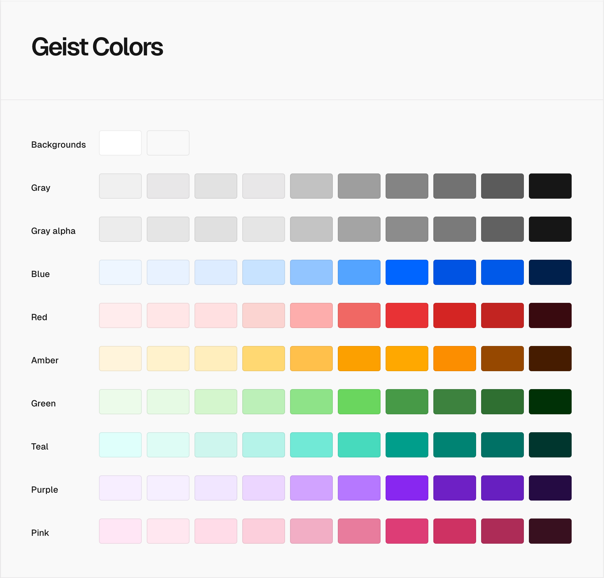

# Geist Design System Colors

<picture>
  <source media="(prefers-color-scheme: dark)" srcset="./assets/colors-dark.png">
  <source media="(prefers-color-scheme: light)" srcset="./assets/colors-light.png">
  
</picture>

## Usage

1. Import Geist Colors you want to use in your CSS

```css
@import "geist-colors/amber";
@import "geist-colors/blue-dark";
@import "geist-colors/background";

.bg {
    background: var(--background-100);
}

.text-amber {
    color: var(--amber-100);
}
```

2. Import it in your JavaScript/TypeScript

```ts
import { amber, blueDark } from "geist-colors";

const amber200 = amber[200];
const blueDark100 = blueDark[100];
```

## Documentation

For full documentation, visit [vercel.com/geist/colors](https://vercel.com/geist/colors).

## Installation

`pnpm add geist-colors`
